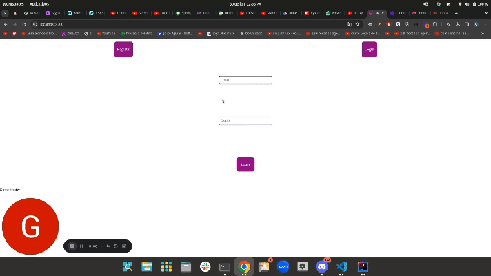
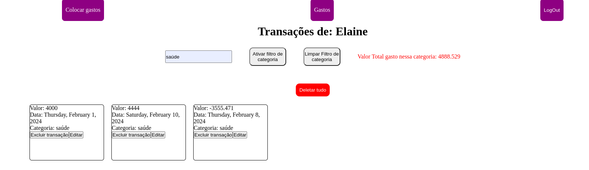

# Projeto do Gill

## Sobre o Projeto

O Desafio do Gill é uma aplicação que gerencia transações financeiras, permitindo que os usuários registrem, visualizem e manipulem suas transações. O sistema é dividido em FrontEnd e BackEnd.

### Tecnologias Utilizadas

#### BackEnd

- **Java 17**: A linguagem de programação utilizada para o desenvolvimento do BackEnd.
- **Spring Boot**: Framework que simplifica o desenvolvimento de aplicações Java.
- **Maven**: Ferramenta de gerenciamento de projetos utilizada para construir e gerenciar dependências.
- **MySQL**: Sistema de gerenciamento de banco de dados relacional utilizado para armazenar dados.

#### FrontEnd

- **Angular**: Biblioteca JavaScript para construção de interfaces de usuário.
- **TypeScript**: Superset do JavaScript que adiciona tipagem estática.

## BackEnd

### Configurações

- todas as dependencias estão no poom.xml o projeto foi feito usando maven com Java 17, basta clonar com `git clone`,
  trocar para a pasta do backend e rodar o comando `mvn clean install`.
- No caminho `main/resources/application.properties`, está feito a conexão com o banco de dados, e a configuração do jpa, estou usando `spring.jpa.hibernate.ddl-auto=update`, para que ele cria minhas entidades no banco de dados mas não possa excluilas apenas atualiza-las.
- o pacote do projeto é `com.transacoes.transacoes` dentro desse pacote a classe principal é a JavaTransactionsApplication.java, que é a classe que sobe o projeto.
- Dentro da minha maquina estava usando o banco de dados Mysql, caso queira mudar tera que adicionar uma nova dependencia no pom.xml e mudar a configuração do banco de dados no application.properties.
- Como eu não sei usar JWT em JAVA e não consegui desenvolver a tempo, estou usando apenas o id da pessoa que é retornado no front end para fazer as requisições, por isso as vezes meio que pareça desnecessário passar o id da pessoa nas requisições, mas é necessário para que o banco de dados saiba a quem pertence a transação.
- CORS: o cors nos controllers está configurado para recener requisições de qualquer lugar, para ficar mais facil de testar, mas caso queira mudar, basta mudar o cors no controller.

### EndPoints

- Lembrando que todos os endpoints estão com o prefixo `http://localhost:8080/` já que essa é a porta que estou usando no meu projeto.
- O controller de transações não tem GET, pois ele é usado apenas para criar, atualizar e deletar transações, para pegar as transações de uma pessoa especifica é necessário usar o controller de pessoa.

#### Person

<details>
<summary>POST</summary>

- Caso o email já exista no banco de dados, ele retorna um erro 400 com a mensagem `Email já existente no banco de dados`.
- `/person` - Cria uma nova pessoa no banco de dados, passando um json no body da requisição, exemplo:

```json
{
  "name": "Gabriel",
  "email": "gabrielferdev@gmail.com",
  "password": "123456"
}
```

</details>
<details>
<summary>GET</summary>

- Caso passe um id que não exista no banco de dados, ele retorna um erro 404 com a mensagem `Pessoa não encontrada`.
- `/person?id={personid}` - Retorna uma pessoa do banco de dados, passando o id da pessoa como parametro na url, tras as transações da pessoa também.

```json
{
  "transactions": [
    {
      "id": 42,
      "value": 55.0,
      "transactiondate": "2024-01-30T00:00:00.000+00:00",
      "category": "comida"
    },
    {
      "id": 43,
      "value": 200.0,
      "transactiondate": "2024-02-03T00:00:00.000+00:00",
      "category": "comida"
    }
  ],
  "email": "hu3master.zord@hotmail.com",
  "name": "gabriel"
}
```

</details>

#### Person Login

<details>
<summary>POST</summary>

- Caso passe um email e senha que não exista no banco de dados, ele retorna um erro 404 com a mensagem `Pessoa não encontrada`.
- Lembrando que as senhas no banco de dados não estão criptografadas, então é necessário tomar cuidado com isso, e também não estou usando jwt apenas uso o id que é retornado no front end para fazer as requisições.
- `/person/login` - Faz o login da pessoa no sistema, passando um json no body da requisição, exemplo:

```json
{
  "email": "algumemailex@gmail.com",
  "password": "senhaexemplo"
}
```

</details>

#### Transaction

<details>
<summary>POST</summary>

- `/transactions?id={transactionid}` - Busca uma transação pelo id fornecido na url, exemplo:
- caso o id da transação não exista no banco de dados, ele retorna um erro 404 com a mensagem `Transação não encontrada`.
- não coloquei no FE mas é uma otima funcionalidade para implementar.

````json
{
	"id": 99,
	"value": 100.5,
	"transactiondate": "2023-02-01T15:30:00.000+00:00",
	"personid": {
		"id": 4,
		"email": "hu3master.zord@hotmail.com",
		"name": "Gabriel Fernandes",
		"password": "gabriel"
	},
	"category": "saúde"
}

</details>

<details>
<summary>POST</summary>

- `/transactions` - Cria uma nova transação no banco de dados, passando um json no body da requisição, exemplo:
- caso o id da pessoa não exista no banco de dados, ele retorna um erro 404 com a mensagem `Pessoa não encontrada`.

```json
{
  "value": 100.5,
  "transactiondate": "2023-02-01T15:30:00.000Z",
  "personid": 5,
  "category": "saúde"
}
````

</details>

<details>
<summary>PUT</summary>

- `/transactions?id={personid}` - Atualiza uma transação no banco de dados, passando um json no body da requisição, exemplo:

```json
{
  "id": 20,
  "value": 100.5,
  "transactiondate": "2023-02-01T15:30:00.000Z",
  "category": "saúde"
}
```

</details>

<details>
<summary>DELETE</summary>

- `/transactions?id={transactionId}` - Deleta uma transação especifica do banco de dados, passando o id da transação como parametro na url e não retorna nada.

</details>

#### Transaction Batch

<details>
<summary>POST</summary>

- `/transactions/batch` - Cria um bulk de transações no banco de dados, passando um json no body da requisição, exemplo:
- Caso um dos ids da pessoa não exista no banco de dados, ele retorna um erro 404 com a mensagem `Pessoa não encontrada`, Porem ele criara novas transações até se encontrar com esse id, resumindo se de um bulk de 100 itens o primeiro for defeituoso ele criara 0 transações.

```json
{
  "numberOfInsertions": "5",
  "value": [
    {
      "value": 100.5,
      "transactiondate": "2023-02-01T15:30:00.000Z",
      "personid": 4,
      "category": "saúde"
    },
    {
      "value": 100.5,
      "transactiondate": "2023-02-01T15:30:00.000Z",
      "personid": 4,
      "category": "saúde"
    },
    {
      "value": 100.5,
      "transactiondate": "2023-02-01T15:30:00.000Z",
      "personid": 4,
      "category": "saúde"
    },
    {
      "value": 100.5,
      "transactiondate": "2023-02-01T15:30:00.000Z",
      "personid": 4,
      "category": "saúde"
    },
    {
      "value": 100.5,
      "transactiondate": "2023-02-01T15:30:00.000Z",
      "personid": 4,
      "category": "saúde"
    }
  ]
}
```

</details>

#### Transaction Category

<details>
<summary>GET</summary>

- `/transactions/category?id={personid}&category={categoria}` - Esse endpoint calcula todos os gastos de uma categoria do usuarios especifico, e retorna um Double com o valor total gasto naquela categoria, exemplo:

```json
100.55
```

</details>

#### Transactions All Delete

<details>
<summary>DELETE</summary>

- `/transactions/all?id={personid}` - Esse endpoint deleta todas as transações de um usuario especifico e não retorna nada, exemplo:

</details>

## FrontEnd

### Configurações

- Para rodar o projeto basta clonar com `git clone`, trocar para a pasta do frontend e rodar o comando `npm install` para instalar todas as dependencias.
- Para rodar o projeto basta rodar o comando `npm start` e ele ira abrir uma aba no seu navegador com o projeto rodando.
- Dentro do arquivo `src/endpoint.ts` está a base url do backend, caso você mude a porta do backend, é necessário mudar a porta no arquivo `endpoint.ts` também.
- O front end só funciona se o backend estiver rodando pois literalmente todas as requisições são feitas para o backend.
- A maneira que é feito o login é muito básico eu simplesmente coloco o ID do usuario em um cookie chamado `security` e uso ele para fazer as requisiçõe, Irei mudar pra JWT assim que eu aprender a usar JWT em Java, fiquei com medo de mudar quebrar tudo e não conseguir arrumar a tempo.
- O Filtro por Id da transação também poderia ser feito pelo BackEnd e esse end-point já existe, mas no nível da aplicação creio que apenas no FE tá melhor também posso estar errado sou leigo.

#### Telas

<details>
<summary>Login</summary>

- Tela para efetuar login de uma conta existente no banco, segue o exemplo:
  <br>
  

</details>

<details>
<summary>Transactions</summary>

- Tela que mostra todas as transações de uma pessoa especifica, nessa tela é possivel manipular as transações, segue o exemplo:
  <br>
  

- Ao Fazer filtrar transações por categorias o retorno é Double logo ele é exato, segue o exemplo:
  <br>
  

</details>

<details>
<summary>Insert</summary>

- Tela que permite inserir transações podendo inserir apenas uma ou um bulk de transações, segue o exemplo:
<br>

</details>

<details>
<summary>Register</summary>

- Tela que permite criar uma nova conta no banco de dados, apos criar a conta você já é logado automaticamente, segue o exemplo:

<br>

</details>
